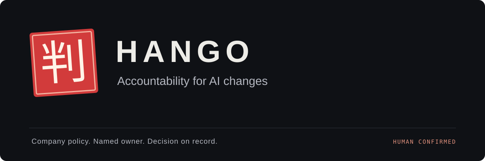

<p align="center">
  
</p>

<p align="center">
  <a href="https://github.com/chrissotraidis/datadoghackathon/actions/workflows/checks.yml"></a>
  
  
  
  
</p>

**AI can make the change. Who can authorize it?**

Hango connects an AI-proposed code change to company policy, a named decision-maker,
and their spoken approval. It shows the impact, asks the owner, and records the
decision against the exact diff—including any condition that keeps release on hold.

A local hackathon prototype with a synthetic billing system. No real customer
dataset is included. The app does not merge or deploy code.

<p align="center">
  <a href="docs/GETTING_STARTED.md">Setup & configuration</a> ·
  <a href="DEMO.md">Present the demo</a> ·
  <a href="VALIDATION.md">Validation</a> ·
  <a href="SECURITY.md">Privacy & security</a>
</p>

## Try it locally

Requires Python 3 and a modern browser. Simulation needs no account, API key,
microphone, or phone number.

```sh
git clone https://github.com/chrissotraidis/datadoghackathon.git
cd datadoghackathon
cp -n web/config.example.js web/config.js
python3 -m http.server 8000 --bind 127.0.0.1
```

Open [Demo Studio](http://127.0.0.1:8000/web/?view=demo), choose **Simulated
conversation**, and follow the next-step guide. The five-second conversation is
explicitly labeled simulated. Live calling requires your own
[private configuration](docs/GETTING_STARTED.md#configuration).

## From proposed change to recorded decision

| Step | What Hango does |
| --- | --- |
| **Understand the impact** | Traces the COBOL tax calculation to three jobs and 1,214 affected records out of 3,000 synthetic customers. |
| **Check the authority** | Uses company policy to identify the owner and explain why approval is required. |
| **Ask and confirm** | Reads the decision back and requires a fresh explicit confirmation. Agreeing to talk is not approval. |
| **Keep the evidence** | Saves the transcript, condition, rationale, tested diff and SHA-256 in a local decision record. |

**Workspace** supports the full review. **Demo Studio** adds presenter cues and
fresh rehearsals while keeping previous records. **Settings** provides light,
dark and system themes, reduced motion, connection checks and record export.

## What works today

- Deterministic source analysis and tested before/after COBOL fixtures.
- Simulated, ElevenLabs phone and browser microphone channels.
- Explicit confirmation checks, one-call locks, and visible open conditions.
- Separate Workspace and Studio ledgers with printable evidence.

The supported proposal changes category 7 tax from 8% to 10%, with a requested
effective date of 1 April 2027. The fixture does not implement an effective-date
guard. Other requests cannot authorize this fixed proposal. Plain approval is
shown as **APPROVED / NOT DEPLOYED**; conditional approval keeps its task open.

Browser records and locks are local, editable storage. This is not production
authorization, identity verification, a tamper-proof ledger, or a compliance
guarantee. Live speech quality still needs a rehearsal in the actual demo setting.
See the [acceptance evidence and limits](VALIDATION.md).

## Development

No application backend, framework or build step. The frontend uses native ES
modules; Python and optional GnuCOBOL validate the fixture.

```sh
python3 scripts/check_public.py
python3 mock/tests/test_rates.py
```

Install GnuCOBOL to test the actual compiled program. Without it, the fixture
runner labels its Decimal fallback as simulated. Open
[/web/test-regression.html](http://127.0.0.1:8000/web/test-regression.html) for the
isolated confirmation and call-flow checks, and
[/web/test-impact.html](http://127.0.0.1:8000/web/test-impact.html) for source-impact
checks. Neither suite places a real call.

| Directory | Contents |
| --- | --- |
| `web/` | Dashboard, settings, voice integration and browser tests |
| `mock/` | Synthetic COBOL system, customers, policy and proposal evidence |
| `agent/` | Voice-agent prompt template |
| `docs/` | Setup and public-repository guidance |
| `scripts/` | Repository privacy checks |

## Contribute

Keep changes small and preserve the distinction between simulation, confirmation
and release. Read [CONTRIBUTING.md](CONTRIBUTING.md) before submitting a change.
Never attach real transcripts, recordings, customer data, phone numbers or keys
to a public issue. Use the [private reporting guidance](SECURITY.md) for sensitive
findings.

A project license has not yet been selected. The stamp artwork is maintained as editable SVG source in `web/assets/`.
